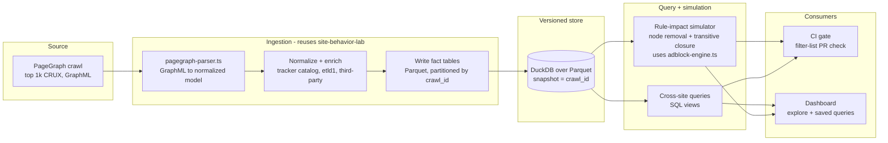

# PageGraph Corpus Database: Project Proposal

**Author:** Sooraj Sathyanarayanan
**Date:** 2026-06-25
**Status:** Draft for review (call scheduled Wednesday 3:15 PT). Phase 0 spike
implemented in-repo: see [pagegraph-corpus-phase0.md](pagegraph-corpus-phase0.md).
**Audience / reviewers:** Pete (pes), Shivan, Anton, Luke Mulks
**Working title:** PageGraph Corpus DB (a.k.a. "the queryable web-behavior corpus")

---

## 1. TL;DR

Build a versioned, queryable database of web page behavior derived from PageGraph
crawls of a large page set (starting with the top 1k CRUX), so we can answer
counterfactual and cross-site questions that flat request logs cannot.

Two flagship queries drive the design, both from Pete:

1. **Rule-impact (counterfactual):** "Show me all the requests, *and downstream
   effects*, that would be blocked if I added filter-list rule X."
2. **Cross-site fact lookup:** "Show me all the persistent values script X sets
   on the top 1k CRUX pages."

Two consumers sit on top of those queries:

- A **CI gate** that runs before Brave ships a filter-list update, so list
  authors see what a rule change blocks and what it breaks downstream *before*
  it goes out. This directly serves Shivan and Anton's interest in the stability
  of lists shipped from the backend.
- A **dashboard** for interactive exploration of the corpus.

The reason PageGraph (not just request logs or CDP initiators) is the right
source: PageGraph is a **causal graph**, so a filter rule reduces to **node
removal plus transitive closure** over the provenance edges. That gives us
"what else *could* stop loading because it depended on the blocked thing"
essentially for free, which is the downstream-breakage signal a list author
needs. It is an upper bound, not a proven counterfactual: a reachable
descendant may have another surviving parent that would still create it, and
proving actual disappearance takes alternate-parent analysis or an
intervention recrawl.

This is a **separate project**, but it leans hard on `site-behavior-lab`, which
already ships the PageGraph to normalized-model adapter, the schema-aware GraphML
parser with the actor to script to injector provenance walk, and Brave's adblock
engine for the per-page "tried vs blocked" primitive.

---

## 2. Motivation

Filter-list changes ship from the backend with limited visibility into their
blast radius. A rule that looks surgical can, in practice, remove a resource that
a first-party feature depends on, or conversely under-block because the real
tracker loads through a chain the rule never touches. Today that risk is assessed
per-page, by hand, after something breaks.

Separately, researchers and list authors repeatedly want corpus-scale answers:
"which scripts set persistent identifiers across the top sites," "what loads only
because tag-manager X is present," "what is the downstream footprint of vendor
Y." These are graph-reachability questions over many pages, and there is no
single place to ask them.

PageGraph already captures the causal structure (who initiated what, which script
injected which node, what storage each script wrote). What is missing is a
**corpus-scale, queryable store** of that structure plus the tooling to ask rule
and cross-site questions against it. This project builds that store and the two
consumers that make it actionable.

Conceptually this is a much cleaner, more informed version of FouAnalytics'
"page x-ray," with far more causal detail and a query surface instead of a single
page view.

---

## 3. Goals and non-goals

### Goals

- Ingest PageGraph crawls into a normalized, columnar, **versioned** fact store.
- Answer Pete's two flagship queries over the top 1k CRUX in a notebook (the MVP
  bar).
- Provide a **rule-impact simulator**: given a filter-list rule (or a diff of
  rules), compute directly-blocked requests, downstream-removed nodes (transitive
  closure), and a breakage-risk signal, per page and aggregated across the corpus.
- Ship a **CI gate** that runs the simulator on filter-list PRs and reports the
  delta.
- Reuse `site-behavior-lab` (parser, adapter, adblock engine) rather than
  rebuilding ingestion.

### Non-goals (for v1)

- Not a replacement for live, per-page scanning. The corpus is a snapshot; live
  scans stay the source of truth for "what does this one page do right now."
- Not a behavioral breakage oracle. The counterfactual is **structural** (what
  would not load). It predicts what disappears, not every JS error cascade a
  removal might trigger. High-impact cases can be confirmed with a verification
  re-crawl (see Risks).
- Not storing any PII or any storage/cookie **values**. We keep the
  value-blind posture `site-behavior-lab` already uses: record key presence, byte
  counts, and identifier *categories*, never the value.
- Not a general crawler project. Crawl source is an open question (Section 9);
  v1 prefers to consume an existing Brave PageGraph crawl.

---

## 4. The core insight: a rule is node removal plus reachability

PageGraph records, per page, a directed causal graph:

- **Nodes:** resources (network requests), scripts, DOM elements, storage slots,
  frames, and actor nodes.
- **Edges:** `request start` / `request complete` / `request error` (paired by
  request id), `js call`, `storage set`, node insertion, and the actor to script
  to injector chain that says *why* each request happened.

`site-behavior-lab`'s parser already walks actor to script to injector edges to
fill request provenance, and reads `storage set` and `js call` edges for storage
and high-entropy API summaries (see `docs/pagegraph-adapter.md`).

Given that graph, a filter-list rule R becomes a graph operation:

1. **Match.** Using Brave's adblock engine (already vendored in
   `lib/adblock-engine.ts`), find the request nodes R would block, with correct
   request-type and first/third-party context.
2. **Remove.** Mark those nodes as directly blocked.
3. **Close.** Take the transitive closure over provenance edges from the blocked
   set: every node *reachable from* a blocked node (a script that a blocked
   script injected, a request that a blocked script initiated, a storage write
   that a removed script made). Reachability over-approximates removal: a node
   with a second, surviving parent stays in the closure even though it might
   still load.
4. **Score.** Aggregate the removed subgraph: count downstream requests removed,
   storage writes removed, fingerprinting calls removed, and flag breakage risk
   when the removed subtree contains first-party or functionally-load-bearing
   nodes.

That is the entire value proposition: **"what would rule X block, and what breaks
downstream" is a reachability query, and it is answered for free once the causal
graph is in the store.** Request logs and CDP `Network.Initiator` give you the
immediate initiator only; they cannot produce the transitive closure.

---

## 5. What we reuse from site-behavior-lab

The project does not start from scratch. The reusable seams already exist:

| Capability | Where it lives today | Reused as |
| --- | --- | --- |
| PageGraph GraphML parsing (schema-aware, tolerant fallback) | `lib/pagegraph-parser.ts` | Ingestion front-end |
| Normalized model + provenance (actor to script to injector) | `lib/pagegraph-adapter.ts`, `NetworkRequestProvenance` in `lib/types.ts` | Source rows for fact tables |
| Brave adblock engine, "would Shields block this?" | `lib/adblock-engine.ts` (vendored WASM + lists) | Rule-match step of the simulator |
| Per-page "tried vs blocked" primitive | `lib/scan-result-builder.ts`, comparison engine | Per-page baseline for the corpus |
| Tracker catalog / CNAME uncloaking / value-blind storage posture | `lib/tracker-catalog.ts`, `lib/cname-uncloaking.ts` | Enrichment + privacy posture |

The new surface is: batch ingestion into a columnar store, versioned snapshots,
the reachability-based rule simulator, the cross-site query layer, and the two
consumers.

---

## 6. Architecture



**Pipeline:** crawl PageGraph, normalize through the existing parser, write fact
tables to Parquet partitioned by crawl snapshot, expose them through DuckDB, and
feed two consumers from the same store. Each crawl is a versioned snapshot, so we
can diff snapshots over time and pin a rule simulation to exact list and Chromium
versions.

**Why DuckDB / Parquet:** the workload is analytical (scan-heavy aggregations and
graph closures over hundreds of millions of edge rows), single-node friendly, and
embeds cleanly into both a notebook and a CI job with no server to operate.
Parquet gives cheap, immutable, versioned snapshots. If the corpus grows past
single-node comfort, the same Parquet files lift into a lakehouse query engine
without re-modeling.

---

## 7. Data model (fact tables)

Star-ish schema. All tables partitioned by `crawl_id` (the snapshot key). The
storage tables stay value-blind by design.

**`crawl`** (one row per snapshot)
`crawl_id, label, source, started_at, finished_at, chromium_version,
pagegraph_version, adblock_list_versions (json), page_count`

**`page`**
`page_id, crawl_id, requested_url, final_url, origin, etld1, crux_rank, status,
scanned_at, title, device`

**`node`** (PageGraph nodes)
`node_id, page_id, graph_record_id, node_type (resource|script|dom|storage|frame|actor),
url, domain, etld1, third_party`

**`edge`** (causal edges)
`edge_id, page_id, src_node_id, dst_node_id, edge_type
(request_start|request_complete|request_error|js_call|storage_set|node_insert),
request_id, ts_ms`

**`request`** (resolved network requests, the simulator's primary target)
`request_id, page_id, node_id, url, domain, etld1, method, resource_type, status,
started_at_ms, third_party, blocked_by_shields, initiator_id, initiator_type,
script_id, script_url, script_etld1, injected_by_id, injected_by_etld1`

**`provenance_edge`** (the reachability graph the simulator walks)
`page_id, child_node_id, parent_node_id, relation
(initiated_by|injected_by|script_of)`

**`storage_op`** (persistent values written, value-blind)
`page_id, op_id, script_node_id, script_url, script_etld1, storage_type
(cookie|localStorage|sessionStorage|indexeddb), key, value_bytes, value_present,
ttl_seconds, third_party`

**`js_call`** (high-entropy / fingerprinting surface)
`page_id, call_id, script_node_id, script_url, script_etld1, api_name, surface
(canvas|webgl|audio|webrtc|navigator|screen), call_count`

`request`, `provenance_edge`, `storage_op`, and `js_call` come straight out of the
normalized model the parser already produces; `node` and `edge` preserve the raw
causal graph so the closure is exact rather than approximated from the flattened
request rows.

---

## 8. The two flagship queries, worked

### 8.1 Rule-impact (counterfactual)

Given rule R and crawl snapshot S:

1. For each page in S, run R through the adblock engine against `request` rows to
   get `directly_blocked = {request nodes R matches}`.
2. Seed the closure with the `node_id`s of those requests; walk
   `provenance_edge` (relations `initiated_by`, `injected_by`, `script_of`)
   transitively to get `downstream_removed`.
3. Emit per page: counts of directly-blocked requests, downstream-removed
   requests, removed `storage_op`s, removed `js_call`s, and a `breakage_risk`
   flag set when `downstream_removed` (or `directly_blocked`) intersects
   first-party or load-bearing nodes (for example a first-party script that other
   first-party nodes depend on).
4. Aggregate across S: pages affected, total downstream footprint, top
   etld1s removed, and a ranked list of high-breakage-risk pages for human review.

Output is a corpus-wide impact report for the rule, plus a drill-down per page.

### 8.2 Cross-site persistent-value lookup

"What persistent values does script X set across the top 1k?" is a single join:

```sql
SELECT p.etld1 AS site, s.storage_type, s.key,
       count(*) AS pages_setting, avg(s.value_bytes) AS avg_bytes
FROM storage_op s
JOIN page p USING (page_id)
WHERE s.crawl_id = :snapshot
  AND s.script_etld1 = :script_etld1
GROUP BY 1, 2, 3
ORDER BY pages_setting DESC;
```

Same store answers the inverse ("which scripts set the most persistent
identifiers corpus-wide") and the identifier-category view (which keys carry
hashed-PII categories) without holding any values.

---

## 9. Open questions and recommendations

These are the four I want to settle on the call. Each has a recommendation, not a
mandate.

**Q1. Crawl source: reuse Brave's existing PageGraph crawl, or stand up a fresh
one?**
*Recommendation: reuse the existing Brave crawl for v1*, with a thin
re-crawl capability for targeted pages (verification runs, gaps). Reusing data
gets us to the two flagship queries fastest and avoids owning crawl infra on day
one. Standing up a dedicated crawl is a Phase 3+ decision once cadence and page
set are proven.

**Q2. Where does it live, and what is the compute/storage budget?**
*Recommendation: a separate repo*, consuming the `site-behavior-lab` parser and
adblock engine as a pinned dependency (vendored package or submodule) so we track
their versions explicitly. Budget estimate in Section 11.

**Q3. Which consumer first: CI gate or dashboard?**
*Recommendation: CI gate first.* It is the higher-leverage, more bounded scope,
and it is exactly the list-stability problem Shivan and Anton raised. The
dashboard is exploratory and can ride on the same query layer afterward.

**Q4. PageGraph as primary source vs CDP `Network.Initiator` for breadth?**
*Recommendation: PageGraph primary, CDP as a breadth fallback.* The transitive
closure is the whole point and only PageGraph gives the full chain to a root
cause. CDP `Network.Initiator` gives the immediate initiator only (no closure,
no injector chain, no storage attribution), so it is a lower-fidelity fallback
for pages where a PageGraph export is unavailable. We mark such rows with reduced
confidence rather than mixing fidelities silently.

---

## 10. Phased plan

| Phase | Scope | Rough effort | Exit criterion |
| --- | --- | --- | --- |
| **0. Spike / MVP** | Ingest N pages through the existing parser into DuckDB; answer both flagship queries in a notebook; sanity-check fidelity against 2 to 3 known cases | ~1 to 2 weeks | Pete's two queries answered end to end in a notebook |
| **1. Hardened ingestion** | Productionize ingestion over the full top 1k; versioned Parquet snapshots; the rule-impact simulator as a library + CLI | ~3 to 5 weeks | One command turns a crawl into a snapshot; simulator runs a rule against a snapshot and emits an impact report |
| **2. CI gate** | Filter-list PR check: run the simulator on the rule diff, post added-blocks + downstream-breakage delta, gate on a breakage-risk threshold | ~3 to 4 weeks | A filter-list PR shows an automated impact comment; a known historical breakage is caught in backtest |
| **3. Dashboard + scale** | Query builder, script/site profiles, rule-impact preview; scale corpus (10k+); CDP breadth fallback | TBD | Interactive exploration over the corpus; corpus beyond 1k |

Effort estimates assume Q1 lands on "reuse existing crawl." Standing up a fresh
crawl adds to Phase 1.

---

## 11. Compute and storage budget (estimate, to validate)

Rough order-of-magnitude for the top 1k, to be confirmed against real exports:

- **Raw PageGraph GraphML:** tens of MB per page is common, so on the order of
  10s of GB for 1k pages. This is the heaviest artifact and we do not need to
  retain it long-term once normalized.
- **Normalized Parquet fact tables:** columnar and compressed, far smaller.
  Expect low hundreds of MB per 1k-page snapshot (a few hundred requests per page,
  more node/edge rows).
- **Ingestion compute:** GraphML parsing is CPU-bound and embarrassingly
  parallel. A single multi-core box ingests 1k pages in minutes to low tens of
  minutes. No cluster needed at this scale.
- **Query compute:** DuckDB on a single node handles snapshots of this size
  interactively; the rule simulator's closure is a bounded graph walk per page.
- **Scaling to 10k / 100k:** storage and ingest scale roughly linearly; DuckDB
  comfortably queries 100s of GB on one node. Beyond that the Parquet files lift
  into a lakehouse engine without remodeling.

Snapshot cadence (weekly to start) and retention policy are budget levers we can
tune; we keep normalized snapshots, not the raw GraphML.

---

## 12. Risks and mitigations

| Risk | Mitigation |
| --- | --- |
| **Counterfactual is structural, not behavioral.** Removing a node predicts what would not load, not every JS error cascade. | Flag it as structural impact; for high-breakage-risk pages, run a verification re-crawl with the rule actually applied and diff against prediction. |
| **Provenance gaps.** Some requests lack provenance; the adapter already warns when none is present. | Mark confidence per row; fall back to CDP `Network.Initiator` for immediate initiator; never silently treat "no provenance" as "no downstream." |
| **Parity with production Shields.** Simulated blocking must match what ships. | Use the same vendored adblock engine and pin exact list + engine versions into each snapshot (`adblock_list_versions` on `crawl`). |
| **Corpus staleness vs web churn.** | Versioned snapshots + regular re-crawl; queries always name a snapshot. |
| **PageGraph fidelity for SPA / late-loading content.** | Record crawl config in the snapshot; allow multiple loads / dwell; treat single-load corpus as a known limitation. |
| **PII exposure.** | Keep the value-blind posture: store key presence, byte counts, and identifier categories, never values. Mirrors `site-behavior-lab`'s existing design. |

---

## 13. Success metrics

- **MVP:** both flagship queries answered in a notebook over real PageGraph data.
- **Simulator fidelity:** on a verification re-crawl, predicted removed set
  matches observed removed set within an agreed tolerance.
- **CI gate value:** catches a known historical list-breakage regression in
  backtest, and surfaces downstream breakage that per-page review would have
  missed.
- **Query usability:** common cross-site questions answerable in a single SQL
  view with interactive latency on the 1k snapshot.

---

## 14. What I want from the call

1. A decision on Q1 to Q4 (crawl source, home + budget, first consumer,
   PageGraph vs CDP).
2. Access to (or a pointer to) an existing Brave PageGraph crawl of the top 1k,
   if Q1 lands on reuse.
3. Agreement that **CI gate is the first consumer**, given the list-stability
   motivation Shivan and Anton raised.
4. A green light on Phase 0 (the notebook MVP) so I can prove the whole path with
   real data before we invest in hardening.

---

## Appendix A. Glossary

- **PageGraph:** Brave's instrumentation that records a page load as a causal
  graph of actors, scripts, resources, storage, and the edges between them.
- **CRUX:** Chrome UX Report; the top 1k is our initial page set.
- **Provenance / transitive closure:** the chain of cause from a request back to
  the script and injector that produced it; the closure is everything reachable
  from a removed node along those edges.
- **Snapshot:** one immutable, versioned crawl ingested into Parquet, pinned to
  exact list and Chromium versions.
- **Value-blind:** we record that a key/identifier exists and its category, never
  its value.

## Appendix B. References

- CDP `Network.Initiator`:
  https://chromedevtools.github.io/devtools-protocol/tot/Network/#type-Initiator
- FouAnalytics page x-ray (conceptual comparison): https://fouanalytics.com/
- `site-behavior-lab` PageGraph adapter note: `docs/pagegraph-adapter.md`
- `site-behavior-lab` PageGraph schema note: `docs/pagegraph-schema.md`
