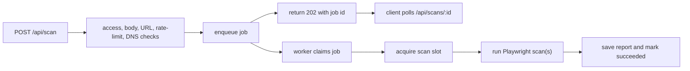

# Scan Job Model Design Note

## Context

The current scanner is intentionally simple: `POST /api/scan` validates the request, runs Playwright inside the HTTP request, saves the report, and returns the full `ScanReport`. That is a good fit for one self-hosted process with a trusted operator token. It becomes the main scaling boundary when scans are exposed to more traffic because a request can hold a connection for the whole scan window, and a GPC comparison runs two visits sequentially.

This note sketches the job-model seam without changing current behavior.

## Goals

- Decouple scan work from the client connection lifetime.
- Preserve the existing validation, access-control, SSRF, rate-limit, scanner, comparison, and report-store modules.
- Keep a single-process implementation possible before introducing Redis/Postgres/worker infrastructure.
- Make future progress reporting real rather than UI-only.
- Keep report permalinks and JSON export behavior compatible.

## Non-Goals

- Multi-user auth or billing.
- A full distributed queue implementation in this step.
- Replacing the report store in the same change.
- Changing scanner evidence semantics or the `ScanReport` shape.

## Proposed Types

Add job types beside the current scan/report types, probably in `lib/types.ts` or a new `lib/scan-jobs.ts`.

```ts
export type ScanJobStatus = "queued" | "running" | "succeeded" | "failed" | "expired" | "cancelled";

export type NormalizedScanJobRequest = {
  url: string;
  device: ScanDevice;
  gpcEnabled: boolean;
  compareGpc: boolean;
  consentMode: ConsentMode;
};

export type ScanJobRecord = {
  id: string;
  status: ScanJobStatus;
  createdAt: string;
  updatedAt: string;
  startedAt?: string;
  finishedAt?: string;
  request: NormalizedScanJobRequest;
  progress?: {
    phase: "queued" | "launching" | "navigating" | "waiting" | "collecting" | "saving";
    completedRuns: number;
    totalRuns: number;
  };
  report?: ScanReport;
  error?: string;
};

export interface ScanJobQueue {
  enqueue(request: NormalizedScanJobRequest, metadata: ScanJobMetadata): Promise<ScanJobRecord>;
  get(id: string): Promise<ScanJobRecord | null>;
  claimNext(): Promise<ScanJobRecord | null>;
  markRunning(id: string, progress?: ScanJobRecord["progress"]): Promise<void>;
  updateProgress(id: string, progress: ScanJobRecord["progress"]): Promise<void>;
  markSucceeded(id: string, report: ScanReport): Promise<void>;
  markFailed(id: string, error: string): Promise<void>;
  pruneExpired(now?: number): Promise<void>;
}

export type ScanJobMetadata = {
  clientKey: string;
  rateLimitCost: 1 | 2;
  accessControlled: boolean;
};
```

The interface is deliberately storage-agnostic. A first implementation can be an in-memory Map plus the current in-process worker loop. A production implementation can back the same shape with SQLite, Postgres, Redis, or a managed queue.

## Request Lifecycle

Current synchronous path:


Proposed asynchronous path:



Important placement decisions:

- Keep `assertScanAccess` before body parsing and rate-limit charging.
- Keep URL normalization, structural URL checks, rate-limit charging, and DNS public-address checks before enqueueing.
- Move `acquireScanSlot` from the HTTP handler to the worker so scan slots model actual scanner work, not waiting HTTP requests.
- Keep report persistence best-effort behavior at the worker boundary: a failed share save should still produce a completed job with a warning, matching current behavior.

## API Shape

Initial async endpoints:

- `POST /api/scan`
  - In compatibility mode, keep returning `ScanReport` exactly as today.
  - In async mode, return `202`:

```json
{
  "ok": true,
  "jobId": "20260619-abc123...",
  "status": "queued",
  "statusPath": "/api/scans/20260619-abc123..."
}
```

- `GET /api/scans/:id`
  - Return status, progress, and the completed report or sanitized error.

```json
{
  "ok": true,
  "jobId": "20260619-abc123...",
  "status": "running",
  "progress": {
    "phase": "waiting",
    "completedRuns": 0,
    "totalRuns": 2
  }
}
```

When complete:

```json
{
  "ok": true,
  "jobId": "20260619-abc123...",
  "status": "succeeded",
  "report": {
    "ok": true,
    "reportType": "comparison"
  }
}
```

The existing `/reports/:id` and `/api/reports/:id` endpoints remain report permalink endpoints, not job endpoints.

## Server Refactor Shape

Split `runScanRequest` into two layers:

```ts
export async function prepareScanRequest(request: Request): Promise<PreparedScanRequest> {
  assertScanAccess(request);
  assertRequestBodySize(request);
  // parse JSON, normalize URL, shape check, rate limit, DNS allow-check
}

export async function executePreparedScan(
  prepared: PreparedScanRequest,
  scan: ScanRunner = scanSite,
  saveReport: ReportSaver = saveScanReport
): Promise<ScanReport> {
  const releaseScanSlot = await acquireScanSlot();
  try {
    // current single/comparison scan execution
  } finally {
    releaseScanSlot();
  }
}
```

Then:

- Current behavior: `POST /api/scan` calls `prepareScanRequest` then `executePreparedScan`.
- Async behavior: `POST /api/scan` calls `prepareScanRequest` then `queue.enqueue`.
- Worker behavior: claims a queued `PreparedScanRequest` and calls `executePreparedScan`.

That split keeps tests cheap: `prepareScanRequest` can be tested without Playwright, and `executePreparedScan` can keep the existing `ScanRunner` and `ReportSaver` injection seams.

## Worker Model

Single-process worker:

- Starts once per Node process.
- Polls the queue in a loop.
- Uses the existing `MAX_CONCURRENT_SCANS` slot logic.
- Stores job records in memory, optionally persisted to disk for crash recovery.

Production worker:

- Runs as a separate process/container.
- Uses shared queue and shared report store.
- Uses the same `executePreparedScan` function.
- Emits structured logs and metrics for job lifecycle events.

## UI Migration

The current loading state can become real progress with minimal shape change:

1. Submit scan.
2. If response is a `ScanReport`, render as today.
3. If response is a job submission, poll `statusPath`.
4. Map job phases to existing loading copy.
5. Render report when status becomes `succeeded`.
6. Show the sanitized job error when status becomes `failed`.

This can be backward compatible by adding a new response union instead of removing the current `ScanApiResponse`.

## Data Store Implications

The job model does not require replacing the report store immediately, but it makes the store boundary more important:

- Job records need expiry independent of report expiry.
- Completed jobs should either embed the completed `ScanReport` or point at the saved report ID.
- History and monitoring features should not query JSON files directly. If those features are planned, move report metadata into SQLite or Postgres before adding them.

Recommended single-node progression:

1. In-memory queue and current filesystem report store.
2. SQLite job/report metadata plus filesystem report body or JSON column.
3. Postgres/Redis-backed queue plus durable shared report storage for multi-node hosting.

## Open Decisions

- Async mode is currently opt-in with `SITE_BEHAVIOR_LAB_ASYNC_SCANS=1`.
- Completed job status currently includes the completed report, preserving the existing UI render path.
- How long should job records live after completion?
- Should client disconnect cancellation exist, or should queued/running jobs be detached from clients once accepted?
- Should GPC comparison expose two sub-run progress events?

## Current Implementation

The first implementation keeps synchronous scans as the default behavior. When `SITE_BEHAVIOR_LAB_ASYNC_SCANS=1` is set, `POST /api/scan` prepares and validates the request, enqueues it in an in-memory single-process queue, and returns `202 { jobId, status, statusPath }`. Job status is ephemeral process memory: a Node restart drops queued, running, and recently completed job records. Completed async reports are saved under the job ID, so the client can recover from a lost `/api/scans/:id` status record by reading `/api/reports/:id` when persistence succeeded. The worker path calls `executePreparedScan`, so slot acquisition, Playwright execution, comparison scans, and report persistence stay behind the same tested execution path.

`GET /api/scans/:id` returns queued/running/succeeded/failed status, progress metadata, and the completed report when available. This is suitable for one Node instance where in-flight restart loss is acceptable. Multi-node hosting or fully restart-resilient polling still needs shared queue/storage before async mode can be treated as durable infrastructure.
