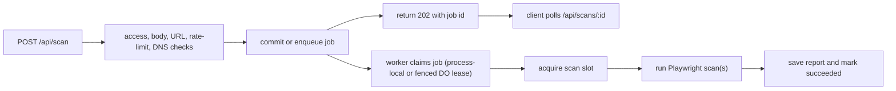

# Scan Job Model Design Note

## Context

The scanner supports both the original synchronous response and an asynchronous
job response. The production container enables async mode: `POST /api/scan`
returns a capability-scoped job ID. With durable jobs disabled, execution remains
in one Node process while the front Worker keeps a bounded IDs-only recovery
registry in Durable Object SQLite. A restart can recover a completed report that
reached R2, but cannot replay queued/running work.

Phase 2 adds an opt-in restart-safe execution path in that same Durable Object,
behind `SITE_BEHAVIOR_LAB_DURABLE_JOBS=1`. The committed deployment configuration
keeps the flag at `0`; the implementation ships in the deployment artifact but is
not activated in production until the external encryption key/private coordinator
setup and staged no-polling lease-expiry test pass. The privacy disclosure is
already published. This note pins both the current flag-off behavior and the gated
Phase-2 contract.

## Goals

- Decouple scan work from the client connection lifetime.
- Preserve the existing validation, access-control, SSRF, rate-limit, scanner, comparison, and report-store modules.
- Preserve the single-process implementation when durable execution is disabled.
- Make future progress reporting real rather than UI-only.
- Keep report permalinks and JSON export behavior compatible.

## Non-Goals

- Multi-user auth or billing.
- A general-purpose or multi-region distributed queue.
- Replacing the report store in the same change.
- Changing scanner evidence semantics or the `ScanReport` shape.

## Public and process-local types

The public job types live beside the scan/report types. Lease, encryption, and
reconciliation states are internal and must map onto this existing wire contract;
they are never new public status strings.

```ts
export type ScanJobStatus = "queued" | "running" | "succeeded" | "failed" | "expired" | "cancelled";

export type NormalizedScanJobRequest = {
  url: string;
  device: ScanDevice;
  gpcEnabled: boolean;
  compareGpc: boolean;
  consentMode: ConsentMode;
};

export type ScanJobRecord = {
  id: string;
  status: ScanJobStatus;
  createdAt: string;
  updatedAt: string;
  startedAt?: string;
  finishedAt?: string;
  request: NormalizedScanJobRequest;
  progress?: {
    phase: "queued" | "launching" | "navigating" | "waiting" | "collecting" | "saving";
    completedRuns: number;
    totalRuns: number;
  };
  report?: ScanReport;
  error?: string;
};

export interface ScanJobQueue {
  enqueue(request: NormalizedScanJobRequest, metadata: ScanJobMetadata): Promise<ScanJobRecord>;
  get(id: string): Promise<ScanJobRecord | null>;
  claimNext(): Promise<ScanJobRecord | null>;
  markRunning(id: string, progress?: ScanJobRecord["progress"]): Promise<void>;
  updateProgress(id: string, progress: ScanJobRecord["progress"]): Promise<void>;
  markSucceeded(id: string, report: ScanReport): Promise<void>;
  markFailed(id: string, error: string): Promise<void>;
  pruneExpired(now?: number): Promise<void>;
}

export type ScanJobMetadata = {
  clientKey: string;
  rateLimitCost: 1 | 2;
  accessControlled: boolean;
};
```

The interface is deliberately storage-agnostic. `clientKey` is process-local
admission data and MUST NOT be copied into a durable payload: in production it can
be the caller's proxy-derived IP. Durable replay is already admitted and charged,
so its encrypted DTO contains only the normalized target and scan options plus a
non-identifying already-charged marker.

## Request Lifecycle

Current synchronous path:


```mermaid
flowchart LR
  A["POST /api/scan"] --> B["access, body, URL, rate-limit, DNS checks"]
  B --> C["acquire scan slot"]
  C --> D["run Playwright scan(s)"]
  D --> E["save report"]
  E --> F["return ScanReport"]
```

Asynchronous compatibility path:


```mermaid
flowchart LR
  A["POST /api/scan"] --> B["access, body, URL, rate-limit, DNS checks"]
  B --> C["commit or enqueue job"]
  C --> D["return 202 with job id"]
  D --> E["client polls /api/scans/:id"]
  C --> W["worker claims job (process-local or fenced DO lease)"]
  W --> X["acquire scan slot"]
  X --> Y["run Playwright scan(s)"]
  Y --> Z["save report and mark succeeded"]
```

Important placement decisions:

- Keep `assertScanAccess` before body parsing and rate-limit charging.
- Keep URL normalization, structural URL checks, rate-limit charging, and DNS public-address checks before enqueueing.
- Move `acquireScanSlot` from the HTTP handler to the worker so scan slots model actual scanner work, not waiting HTTP requests.
- Keep v1 compatibility persistence behavior at the worker boundary. Public r2
  production requires a committed report; durable execution fails or reconciles
  explicitly rather than claiming success without the R2 bundle.

## API Shape

Initial async endpoints:

- `POST /api/scan`
  - In compatibility mode, keep returning `ScanReport` exactly as today.
  - In async mode, return `202`:

```json
{
  "ok": true,
  "jobId": "20260619-abc123...",
  "status": "queued",
  "statusPath": "/api/scans/20260619-abc123...",
  "reportId": "20260619-def456..."
}
```

  - `reportId` is the ID the finished report will be saved and shared under.
    It is minted separately from `jobId` so a shared report link can never be
    turned into the screenshot-bearing status URL; the submitter keeps it to
    recover the saved report if the in-memory job record is lost.

- `GET /api/scans/:id`
  - Return status, progress, and the completed report or sanitized error.

```json
{
  "ok": true,
  "jobId": "20260619-abc123...",
  "status": "running",
  "progress": {
    "phase": "waiting",
    "completedRuns": 0,
    "totalRuns": 2
  }
}
```

When complete:

```json
{
  "ok": true,
  "jobId": "20260619-abc123...",
  "status": "succeeded",
  "report": {
    "ok": true,
    "reportType": "comparison"
  }
}
```

The existing `/reports/:id` and `/api/reports/:id` endpoints remain report permalink endpoints, not job endpoints.

## Server Refactor Shape

Split `runScanRequest` into two layers:

```ts
export async function prepareScanRequest(request: Request): Promise<PreparedScanRequest> {
  assertScanAccess(request);
  assertRequestBodySize(request);
  // parse JSON, normalize URL, shape check, rate limit, DNS allow-check
}

export async function executePreparedScan(
  prepared: PreparedScanRequest,
  scan: ScanRunner = scanSite,
  saveReport: ReportSaver = saveScanReport
): Promise<ScanReport> {
  const releaseScanSlot = await acquireScanSlot();
  try {
    // current single/comparison scan execution
  } finally {
    releaseScanSlot();
  }
}
```

Then:

- Current behavior: `POST /api/scan` calls `prepareScanRequest` then `executePreparedScan`.
- Async behavior: `POST /api/scan` calls `prepareScanRequest` then `queue.enqueue`.
- Worker behavior: claims a queued `PreparedScanRequest` and calls `executePreparedScan`.

That split keeps tests cheap: `prepareScanRequest` can be tested without Playwright, and `executePreparedScan` can keep the existing `ScanRunner` and `ReportSaver` injection seams.

## Worker model

Flag-off single-process worker:

- Starts once per Node process.
- Polls the queue in a loop.
- Uses the existing `MAX_CONCURRENT_SCANS` slot logic.
- Stores queued/running job records in memory. The edge registry stores IDs only
  and can recover a completed R2 report, but does not replay execution.

Flag-on durable worker:

- Keeps the queue authority, encrypted payload, lease state, and terminal metadata
  in the existing singleton `ScannerContainer` Durable Object.
- Uses the Containers library's persistent `schedule()` callback to drain work and
  reconcile deadlines independently of HTTP, health, or polling traffic. It never
  overrides the base Container alarm handler.
- Cold-starts or calls the Node container through a private coordinator channel,
  then reuses the same `executePreparedScan` function.
- Uses shared R2 report storage and emits structured lifecycle logs.
- Keeps status, cancellation, quota, scheduling, and per-job execution routing
  authoritative in the default singleton Durable Object. With the independent
  post-durability sharding gate enabled, only private fenced activation, abort,
  and reconciliation requests use named container instances; Phase-1 work and
  every public control request remain on the singleton.

## UI Migration

The current loading state can become real progress with minimal shape change:

1. Submit scan.
2. If response is a `ScanReport`, render as today.
3. If response is a job submission, poll `statusPath`.
4. Map job phases to existing loading copy.
5. Render report when status becomes `succeeded`.
6. Show the sanitized job error when status becomes `failed`.

This can be backward compatible by adding a new response union instead of removing the current `ScanApiResponse`.

## Data Store Implications

The job model does not require replacing the report store immediately, but it makes the store boundary more important:

- Job records need expiry independent of report expiry.
- Completed jobs should either embed the completed `ScanReport` or point at the saved report ID.
- History and monitoring features should not query JSON files directly. If those features are planned, move report metadata into SQLite or Postgres before adding them.

Deployed progression:

1. In-memory queue plus the configured report store (flag off).
2. IDs-only Durable Object registry plus R2 completed-report recovery (Phase 1,
   flag off).
3. Encrypted Durable Object admission, scheduled fenced leases, and R2
   reconciliation (Phase 2, opt-in and gated).
4. Bounded durable-execution sharding (opt-in after Phase 2 is live and proven).
   The route selected at admission is stored atomically with the job, so retries,
   cancellation, reconciliation, count changes, and a flag rollback keep using
   the same execution owner. Pre-sharding rows default to the singleton.
5. Encrypted scheduled rescans (independent opt-in after Phase 2 is live and
   proven). The coordinator owns only encrypted immutable target/options plus
   bounded non-content schedule/history metadata; every due run is admitted as
   a normal durable job after fresh Node target validation.

## Compatibility decisions

- Async mode is currently opt-in with `SITE_BEHAVIOR_LAB_ASYNC_SCANS=1`.
- Completed job status currently includes the completed report, preserving the existing UI render path.
- Terminal job metadata and capability linkage are retained for at most 75 minutes
  from admission. Sensitive active payload ciphertext is deleted on every terminal
  outcome and is also hard-bounded by that window.
- Accepted work is detached from the client connection. A disconnect only stops
  local polling; explicit authenticated `DELETE /api/scans/:id` is the cancellation
  operation.
- Public statuses remain `queued`, `running`, `succeeded`, `failed`, `expired`, or
  `cancelled`. Lease/replay/publication/reconciliation states map into them.
- Comparison progress remains aggregate and preserves the existing response shape.

## Current Implementation

The synchronous path remains the default. With `SITE_BEHAVIOR_LAB_ASYNC_SCANS=1`
and `SITE_BEHAVIOR_LAB_DURABLE_JOBS=0`, `POST /api/scan` prepares and validates
the request, enqueues it in an in-memory single-process queue, and returns
`202 { jobId, status, statusPath, reportId }`. A Node restart drops queued,
running, and recently completed process records. Completed async reports are saved
under the submission's separate `reportId`, never the job ID: the status channel
(`/api/scans/:jobId`) can carry the screenshot and is a capability held only by
the submitter, so the job ID must never be derivable from a shared report link.
The submitter can recover from a lost status record by reading
`/api/reports/:reportId` when persistence succeeded. The worker path calls
`executePreparedScan`, so slot acquisition, Playwright execution, comparison
scans, and report persistence stay behind the same tested execution path.

`GET /api/scans/:id` returns queued/running/succeeded/failed status, progress
metadata, and the completed report when available. In the current flag-off path,
the front Worker keeps the job ID, separate report ID, run count, and admission
timestamp in Durable Object SQLite for 75 minutes. After a Node restart it can
embed a persisted R2 report in a recovered `succeeded` response or return an
explicit restart `expired` response when the report is genuinely absent. The
Phase-1 registry contains no target URL or client identifier. Queued/running
execution remains in-process while the Phase-2 flag is `0`.

## Durable Job State Design (accepted 2026-07-13)

Restart-safe jobs live in the scanner's existing singleton Durable Object
(`ScannerContainer`), which already owns an atomic SQLite quota ledger. No new
store (no D1/KV) is introduced. Two phases, both bounded and privacy-explicit:

### Phase 1: durable job registry (ids only, no payload; implemented)

At admission (the front Worker sees the container's `202 { jobId, reportId }`),
the Worker records `(job_id, report_id, total_runs, created_at)` in DO SQLite.
On a later `GET /api/scans/:id` where the container answers 404 (a restart or
retention pressure dropped the in-memory record), the Worker consults the
registry and, for a known job, first probes `GET /api/reports/:reportId` on the
container:

- Report exists: the job finished and persisted before the restart. Answer
  with a `succeeded` status that embeds the saved, screenshot-stripped report,
  preserving the existing client and automation response contract.
- Report absent: answer an honest terminal `expired` status whose error names
  the lost in-memory record, instead of an indistinguishable "unknown job" 404.

For `DELETE`, a known registry row returns a control-only `409`: there is no
in-memory worker left to cancel, and the response never includes report data.

Rows carry no target URL and no client identifier: only TTL-bounded capability
linkage and scheduling metadata. TTL 75 minutes (job max age + expired
retention), pruned on write, hard row cap with oldest-first eviction. The
best-effort write runs in `waitUntil`; failures are logged and never replace
the container's already-accepted `202` response.

### Phase 2: durable execution (implemented; disabled in production behind an activation gate)

When `SITE_BEHAVIOR_LAB_DURABLE_JOBS=1`, queued jobs persist a dedicated
encrypted execution DTO so a restarted container can resume accepted work. This
does not reuse `PreparedScanRequest` verbatim.

#### Synchronous admission and privacy

- The Worker returns the existing `202` response only after the IDs-only linkage,
  execution state, application-encrypted payload, and request-independent drain
  schedule have all been accepted. A storage, encryption, scheduling, or private
  coordinator failure refuses admission; Phase-2 durability is never a
  best-effort post-response write.
- The AES-256-GCM payload contains only a version, scheme + host + path (no query
  or fragment), desktop/mobile choice, GPC and comparison-mode flags,
  non-identifying already-charged metadata, admission time, and required report
  mode. Its 32-byte base64url key remains Worker-only. The payload excludes IP and
  client hash, Turnstile and access tokens, all request/authorization headers,
  cookies, screenshots, observations, and results.
- Opaque IDs, timestamps, public status/progress, attempt count, lease generation
  and token hash, deadlines, and reconciliation state are non-content operational
  metadata and are stored without application encryption. They contain neither
  the target nor a client identifier.
- Active ciphertext is deleted on `succeeded`, `failed`, `expired`, or `cancelled`
  and is hard-bounded to 75 minutes. Cloudflare platform recovery snapshots may
  retain application-encrypted copies until their own retention window expires.

#### Activation gate: bound in-flight uncommitted preparations

The durable admission path preflights quota with a *peek*
(`assertDeferredScanRateLimitAvailable`) and charges it atomically only inside
`admitDurablePreparation`, which runs after the request has crossed to Node
`/prepare`. Quota integrity is preserved because the Durable Object serializes
the commits, but the preparation work between the peek and the commit is not
bounded by anything: N concurrent requests can all clear the peek, all perform
preparation (including a fresh DNS resolution of the caller's target), and only
then lose the race. Turnstile redemption is idempotent per capability by
design, so a single solved token replayed concurrently reaches the peek N times
and no committed admission exists yet to deduplicate them.

Before `SITE_BEHAVIOR_LAB_DURABLE_JOBS=1`, either reserve the quota slot at
admission time and release it on failure, or cap concurrent uncommitted
preparations per capability hash. The live synchronous path is unaffected: it
charges atomically up front (`chargeMode: "charge"`).

#### Scheduled liveness and fenced leases

- The Durable Object enforces the aggregate queue cap and claims oldest-first.
  Its inherited persistent `schedule()` facility drains queued work, expires
  leases, and reconciles publication independently of health requests, status
  polls, or any other HTTP traffic. It does not override the Containers library's
  alarm handler and does not store target data in a schedule payload.
- Each claim increments the attempt and lease generation and mints a random fenced
  token. Claim, heartbeat, progress, begin-publication, and resolution mutations
  require the current generation and token. A late first worker cannot mutate or
  publish for a re-leased job.
- A job gets at most two execution attempts. Only an expired `leased` attempt that
  never crossed begin-publication may be requeued. Replay does not repeat Turnstile
  or charge either edge or Node quotas: it is the same admitted work. Once the
  Durable Object accepts begin-publication, that report capability is a no-requeue
  point because an aborted conditional R2 PUT can still have an unknown outcome.

#### Cancellation and publication fencing

- The Durable Object is authoritative for status in Phase 2. `DELETE` can atomically
  cancel queued or leased work before publication, delete its ciphertext, fence
  the lease, and best-effort abort the local scanner. Repeated cancellation is
  idempotent and remains a control-only response with no report or `reportId`.
- Begin-publication and cancellation race in one fenced Durable Object transition.
  If cancellation wins, the stale worker cannot invoke R2 persistence. If
  publication wins, `DELETE` preserves the existing `409` contract instead of
  falsely claiming the externally visible write was cancelled.
- Begin-publication atomically renews the publishing lease, but only when the
  60-second Node publication bound, 30-second settlement window, and 30-second
  final reconciliation bound fit before the job deadline. Publishing heartbeats
  preserve that deadline reserve. The same
  AbortSignal covers the in-process mutation FIFO, every report/sidecar operation,
  R2 retry backoff, signing, fetch, and response-body consumption; an external
  abort stops retries and prevents any later backend dispatch.

#### Publication manifest and R2 reconciliation

- Before R2 publication, the job records a small non-content manifest: `reportId`,
  the exact stored-report wire SHA-256 and byte length, the public canonical
  digest, the exact provenance-sidecar wire (including canonicalization and
  redaction versions), and immutable creation/expiry clocks. It contains no report
  body, screenshot, or target URL.
- Reuse of the admission-minted `reportId` is necessary but not sufficient for
  idempotence: ordinary create-only R2 conflicts are not success. Reconciliation
  reads and validates the bundle against the manifest. A complete exact bundle is
  marked `succeeded` and returned without another site visit. A primary-only exact
  bundle can have its exact sidecar repaired from the manifest; mismatched or
  invalid bytes fail closed and are never overwritten or blindly deleted. An exact
  sidecar without a primary is preserved and fails terminally rather than poisoning
  a same-ID rescan or deleting a marker that a concurrent writer may have committed.
- After the publishing lease and settlement fence, an exact committed bundle whose
  Durable Object resolution was lost reconciles to success. Integrity failures and
  a still-missing bundle fail terminally; neither result admits another generation.
  This single-writer rule prevents a late old-generation PUT from racing a rescan
  under the same `reportId`. Private reconciliation has its own 30-second storage
  bound so a stalled R2 read cannot accumulate overlapping Worker-to-Node work.

The committed deployment keeps `SITE_BEHAVIOR_LAB_DURABLE_JOBS=0`. Enabling it
requires `SITE_BEHAVIOR_LAB_DURABLE_JOBS_KEY`, a distinct
`SITE_BEHAVIOR_LAB_DURABLE_JOBS_INTERNAL_TOKEN`, the non-secret fixed
`SITE_BEHAVIOR_LAB_DURABLE_JOBS_COORDINATOR_URL`, R2/public-r2 readiness, the live
privacy disclosure, and a live test that abandons the first lease and observes the
scheduled second attempt complete under the same `reportId` without polling or
health traffic. Only after that gate may production turn the flag on.

### Post-durability encrypted scheduled rescans

`SITE_BEHAVIOR_LAB_ENCRYPTED_WATCHES=1` is a separate rollout after durable jobs
are production-ready. It does not create another execution queue: the singleton
coordinator schedules due watches, decrypts one strict payload transiently, asks
the authenticated private Node route to freshly validate DNS and prepare it,
then admits the resulting ordinary durable job. The existing persistent schedule
drives both job recovery and watch cadence without status polling.

Watch storage is bounded to a seven-day cadence, 30-day TTL, five attempts, 32 active
watches, and 100 scheduled admissions per UTC day. The 128-bit watch ID is
non-secret; control requires an independent 256-bit capability, of which only a
SHA-256 digest is stored. AES-256-GCM protects the exact query-free target and
single-mode r2 options under a distinct Worker-only key. One optional previous
key supports rotation while new envelopes always use the current key. Opaque
timestamps, run count, lease fences, and bounded job/report outcome linkage are
stored separately; no target, IP, client hash, Turnstile token, or request
credential appears there.

Public creation uses the normal scan admission gate: Turnstile and atomic quota
on an open scanner, or the scanner's ordinary token when operator-gated. A
distinct optional watch-only second factor exists for isolated canaries and
cannot bypass that gate. Creation, target decryption, and due claims also fail
closed unless the feature keyring and durable jobs are ready.
Capability-authenticated metadata read and deletion remain usable
when the flag is rolled back or a key is temporarily unavailable, so operators
can purge retained ciphertext. Each due run repeats Node DNS/public-address
validation and still uses the browser's connect-time public-address proxy. See
[encrypted-watches.md](encrypted-watches.md) for the public contract, rotation
ceremony, activation canary, and report-retention caveat.
