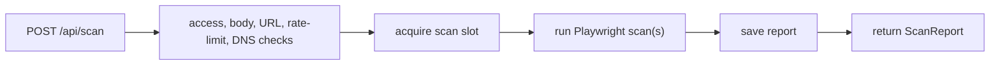
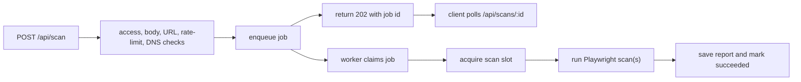

# Scan Job Model Design Note

## Context

The scanner supports both the original synchronous response and an in-process
async queue. The production container enables async mode: `POST /api/scan`
returns a capability-scoped job ID, while the front Worker keeps a bounded
IDs-only recovery registry in Durable Object SQLite. A restart can recover a
completed report that reached R2, but queued/running execution is not replayed.

This note records the implemented Phase-1 seam and the still-pending Phase-2
durable execution protocol. The detailed status is pinned under Current
Implementation below.

## Goals

- Decouple scan work from the client connection lifetime.
- Preserve the existing validation, access-control, SSRF, rate-limit, scanner, comparison, and report-store modules.
- Keep a single-process implementation possible before introducing Redis/Postgres/worker infrastructure.
- Make future progress reporting real rather than UI-only.
- Keep report permalinks and JSON export behavior compatible.

## Non-Goals

- Multi-user auth or billing.
- A full distributed queue implementation in this step.
- Replacing the report store in the same change.
- Changing scanner evidence semantics or the `ScanReport` shape.

## Proposed Types

Add job types beside the current scan/report types, probably in `lib/types.ts` or a new `lib/scan-jobs.ts`.

```ts
export type ScanJobStatus = "queued" | "running" | "succeeded" | "failed" | "expired" | "cancelled";

export type NormalizedScanJobRequest = {
  url: string;
  device: ScanDevice;
  gpcEnabled: boolean;
  compareGpc: boolean;
  consentMode: ConsentMode;
};

export type ScanJobRecord = {
  id: string;
  status: ScanJobStatus;
  createdAt: string;
  updatedAt: string;
  startedAt?: string;
  finishedAt?: string;
  request: NormalizedScanJobRequest;
  progress?: {
    phase: "queued" | "launching" | "navigating" | "waiting" | "collecting" | "saving";
    completedRuns: number;
    totalRuns: number;
  };
  report?: ScanReport;
  error?: string;
};

export interface ScanJobQueue {
  enqueue(request: NormalizedScanJobRequest, metadata: ScanJobMetadata): Promise<ScanJobRecord>;
  get(id: string): Promise<ScanJobRecord | null>;
  claimNext(): Promise<ScanJobRecord | null>;
  markRunning(id: string, progress?: ScanJobRecord["progress"]): Promise<void>;
  updateProgress(id: string, progress: ScanJobRecord["progress"]): Promise<void>;
  markSucceeded(id: string, report: ScanReport): Promise<void>;
  markFailed(id: string, error: string): Promise<void>;
  pruneExpired(now?: number): Promise<void>;
}

export type ScanJobMetadata = {
  clientKey: string;
  rateLimitCost: 1 | 2;
  accessControlled: boolean;
};
```

The interface is deliberately storage-agnostic. A first implementation can be an in-memory Map plus the current in-process worker loop. A production implementation can back the same shape with SQLite, Postgres, Redis, or a managed queue.

## Request Lifecycle

Current synchronous path:


```mermaid
flowchart LR
  A["POST /api/scan"] --> B["access, body, URL, rate-limit, DNS checks"]
  B --> C["acquire scan slot"]
  C --> D["run Playwright scan(s)"]
  D --> E["save report"]
  E --> F["return ScanReport"]
```

Proposed asynchronous path:


```mermaid
flowchart LR
  A["POST /api/scan"] --> B["access, body, URL, rate-limit, DNS checks"]
  B --> C["enqueue job"]
  C --> D["return 202 with job id"]
  D --> E["client polls /api/scans/:id"]
  C --> W["worker claims job"]
  W --> X["acquire scan slot"]
  X --> Y["run Playwright scan(s)"]
  Y --> Z["save report and mark succeeded"]
```

Important placement decisions:

- Keep `assertScanAccess` before body parsing and rate-limit charging.
- Keep URL normalization, structural URL checks, rate-limit charging, and DNS public-address checks before enqueueing.
- Move `acquireScanSlot` from the HTTP handler to the worker so scan slots model actual scanner work, not waiting HTTP requests.
- Keep report persistence best-effort behavior at the worker boundary: a failed share save should still produce a completed job with a warning, matching current behavior.

## API Shape

Initial async endpoints:

- `POST /api/scan`
  - In compatibility mode, keep returning `ScanReport` exactly as today.
  - In async mode, return `202`:

```json
{
  "ok": true,
  "jobId": "20260619-abc123...",
  "status": "queued",
  "statusPath": "/api/scans/20260619-abc123...",
  "reportId": "20260619-def456..."
}
```

  - `reportId` is the ID the finished report will be saved and shared under.
    It is minted separately from `jobId` so a shared report link can never be
    turned into the screenshot-bearing status URL; the submitter keeps it to
    recover the saved report if the in-memory job record is lost.

- `GET /api/scans/:id`
  - Return status, progress, and the completed report or sanitized error.

```json
{
  "ok": true,
  "jobId": "20260619-abc123...",
  "status": "running",
  "progress": {
    "phase": "waiting",
    "completedRuns": 0,
    "totalRuns": 2
  }
}
```

When complete:

```json
{
  "ok": true,
  "jobId": "20260619-abc123...",
  "status": "succeeded",
  "report": {
    "ok": true,
    "reportType": "comparison"
  }
}
```

The existing `/reports/:id` and `/api/reports/:id` endpoints remain report permalink endpoints, not job endpoints.

## Server Refactor Shape

Split `runScanRequest` into two layers:

```ts
export async function prepareScanRequest(request: Request): Promise<PreparedScanRequest> {
  assertScanAccess(request);
  assertRequestBodySize(request);
  // parse JSON, normalize URL, shape check, rate limit, DNS allow-check
}

export async function executePreparedScan(
  prepared: PreparedScanRequest,
  scan: ScanRunner = scanSite,
  saveReport: ReportSaver = saveScanReport
): Promise<ScanReport> {
  const releaseScanSlot = await acquireScanSlot();
  try {
    // current single/comparison scan execution
  } finally {
    releaseScanSlot();
  }
}
```

Then:

- Current behavior: `POST /api/scan` calls `prepareScanRequest` then `executePreparedScan`.
- Async behavior: `POST /api/scan` calls `prepareScanRequest` then `queue.enqueue`.
- Worker behavior: claims a queued `PreparedScanRequest` and calls `executePreparedScan`.

That split keeps tests cheap: `prepareScanRequest` can be tested without Playwright, and `executePreparedScan` can keep the existing `ScanRunner` and `ReportSaver` injection seams.

## Worker Model

Single-process worker:

- Starts once per Node process.
- Polls the queue in a loop.
- Uses the existing `MAX_CONCURRENT_SCANS` slot logic.
- Stores job records in memory, optionally persisted to disk for crash recovery.

Production worker:

- Runs as a separate process/container.
- Uses shared queue and shared report store.
- Uses the same `executePreparedScan` function.
- Emits structured logs and metrics for job lifecycle events.

## UI Migration

The current loading state can become real progress with minimal shape change:

1. Submit scan.
2. If response is a `ScanReport`, render as today.
3. If response is a job submission, poll `statusPath`.
4. Map job phases to existing loading copy.
5. Render report when status becomes `succeeded`.
6. Show the sanitized job error when status becomes `failed`.

This can be backward compatible by adding a new response union instead of removing the current `ScanApiResponse`.

## Data Store Implications

The job model does not require replacing the report store immediately, but it makes the store boundary more important:

- Job records need expiry independent of report expiry.
- Completed jobs should either embed the completed `ScanReport` or point at the saved report ID.
- History and monitoring features should not query JSON files directly. If those features are planned, move report metadata into SQLite or Postgres before adding them.

Recommended single-node progression:

1. In-memory queue and current filesystem report store.
2. SQLite job/report metadata plus filesystem report body or JSON column.
3. Postgres/Redis-backed queue plus durable shared report storage for multi-node hosting.

## Open Decisions

- Async mode is currently opt-in with `SITE_BEHAVIOR_LAB_ASYNC_SCANS=1`.
- Completed job status currently includes the completed report, preserving the existing UI render path.
- Terminal in-process records and the edge recovery registry retain a job capability for at most 75 minutes from admission; running work remains until its bounded scan finishes.
- Should client disconnect cancellation exist, or should queued/running jobs be detached from clients once accepted?
- Should GPC comparison expose two sub-run progress events?

## Current Implementation

The first implementation keeps synchronous scans as the default behavior. When `SITE_BEHAVIOR_LAB_ASYNC_SCANS=1` is set, `POST /api/scan` prepares and validates the request, enqueues it in an in-memory single-process queue, and returns `202 { jobId, status, statusPath, reportId }`. Job status is ephemeral process memory: a Node restart drops queued, running, and recently completed job records. Completed async reports are saved under the submission's separate `reportId`, never the job ID: the status channel (`/api/scans/:jobId`) can carry the screenshot and is a capability held only by the submitter, so the job ID must never be derivable from a shared report link. (The reverse direction is not a secrecy boundary: the submitter intentionally receives both IDs in the `202` response.) The submitter can recover from a lost status record by reading `/api/reports/:reportId` when persistence succeeded. The worker path calls `executePreparedScan`, so slot acquisition, Playwright execution, comparison scans, and report persistence stay behind the same tested execution path.

`GET /api/scans/:id` returns queued/running/succeeded/failed status, progress metadata, and the completed report when available. The Cloudflare Containers front Worker additionally keeps the job ID, separate report ID, run count, and admission timestamp in its existing Durable Object SQLite for 75 minutes. If the Node process has restarted and now returns 404, the Worker either embeds the persisted R2 report in a recovered `succeeded` response or returns an explicit restart `expired` response when the report is genuinely absent. The registry contains no target URL or client identifier. Queued/running execution is still in-process and is not replayed, so multi-node hosting or fully restart-resilient execution still needs the phase-2 protocol below.

## Durable Job State Design (accepted 2026-07-13)

Restart-safe jobs live in the scanner's existing singleton Durable Object
(`ScannerContainer`), which already owns an atomic SQLite quota ledger. No new
store (no D1/KV) is introduced. Two phases, both bounded and privacy-explicit:

### Phase 1: durable job registry (ids only, no payload; implemented)

At admission (the front Worker sees the container's `202 { jobId, reportId }`),
the Worker records `(job_id, report_id, total_runs, created_at)` in DO SQLite.
On a later `GET /api/scans/:id` where the container answers 404 (a restart or
retention pressure dropped the in-memory record), the Worker consults the
registry and, for a known job, first probes `GET /api/reports/:reportId` on the
container:

- Report exists: the job finished and persisted before the restart. Answer
  with a `succeeded` status that embeds the saved, screenshot-stripped report,
  preserving the existing client and automation response contract.
- Report absent: answer an honest terminal `expired` status whose error names
  the lost in-memory record, instead of an indistinguishable "unknown job" 404.

For `DELETE`, a known registry row returns a control-only `409`: there is no
in-memory worker left to cancel, and the response never includes report data.

Rows carry no target URL and no client identifier: only TTL-bounded capability
linkage and scheduling metadata. TTL 75 minutes (job max age + expired
retention), pruned on write, hard row cap with oldest-first eviction. The
best-effort write runs in `waitUntil`; failures are logged and never replace
the container's already-accepted `202` response.

### Phase 2: durable execution (leases and replay; protocol pending)

Queued jobs additionally persist their PREPARED payload so a restarted
container can resume work it accepted. Design constraints, in force:

- **Privacy.** The payload row stores the normalized target (scheme + host +
  path, exactly what the scanner receives today), device, mode flags, and the
  admission-time rate-limit charge record. It is deleted on terminal state and
  expires with the job TTL either way. This is the first time a target URL
  rests at the edge, so the row is encrypted with a Worker secret
  (AES-GCM via WebCrypto) and the privacy page discloses transient queue
  storage alongside the existing IP/rate-limit disclosure BEFORE the phase
  ships.
- **Leases.** The container claims work through the Worker
  (`claimNextScanJob(leaseSeconds)`): the DO marks the row leased with an
  expiry; completion/failure reports back through the Worker
  (`resolveScanJob`); an expired lease returns the job to the queue with a
  bounded attempt counter (2 attempts, then terminal `failed` with a restart
  note). Turnstile is NOT re-verified on replay: admission consumed the
  human check and the charge; replay is the same admitted work.
- **Ordering and bounds.** The DO enforces the same aggregate admission cap
  the process queue enforces today (`MAX_QUEUED_JOBS`); claims are
  oldest-first; the poll loop rides the container's existing request cycle
  (the Worker pings a claim endpoint when the container reports idle
  capacity on health), never a busy timer in the DO.
- **Idempotent persistence.** Replayed jobs save under the SAME reportId
  minted at admission (create-only R2 writes make a duplicate save a no-op
  conflict), so a lease that expired mid-save cannot publish twice.
- **Deadlines.** A job unclaimed or unresolved past the job max age is marked
  terminal `expired` by the next registry write (no alarms needed); the
  client's existing recovery path covers the completed-but-unresolved case.

Phase 1 is implemented without changing the container image. Phase 2 changes
the container's queue seam (`scan-jobs.ts` gains a DO-backed intake alongside
the in-process queue behind `SITE_BEHAVIOR_LAB_DURABLE_JOBS=1`) and MUST land
with a privacy-page disclosure and a live lease-expiry test before the flag is
enabled in production. Before implementation, its protocol still needs a
fenced lease token, explicit cancellation semantics, request-cycle-independent
liveness, and readback/reconciliation rules for every R2 save crash window.
